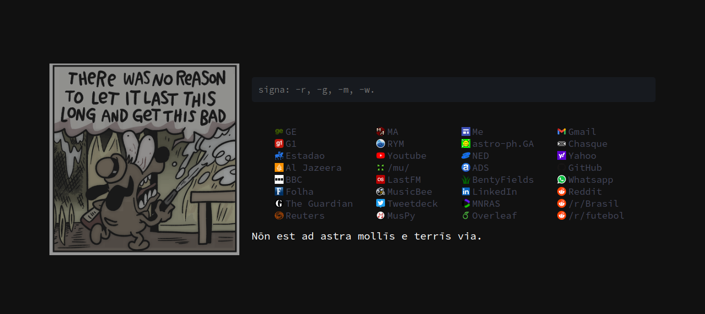

# Start-Page
The start-page I use daily at home (Firefox Nightly) and at work (Brave). It's not only useful to me, but it is also a way for me to learn more about HTML, CSS, JavaScript, etc. So don't expect something advanced at this point, and probabily some stuff will be highly experimental as I toy with some stuff I learn from here and there.

# Usage
Liked it and want to set it as your own startpage, replacing your new tab interface? Nice! Go on.

But if you don't know how to use this as your startpage, take a look at google and start learning alongside me. It's very easy, I promise.

